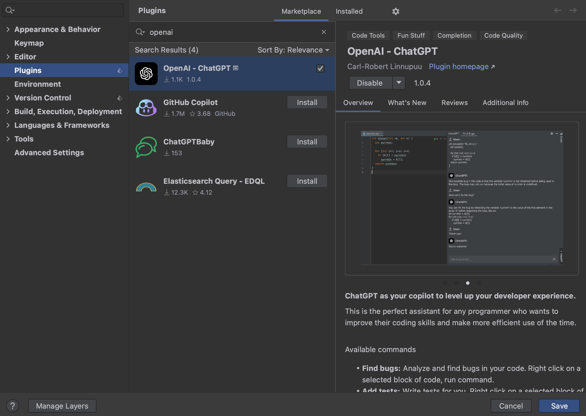

 

# CodeGPT IntelliJ Plugin
CodeGPT as your copilot to level up your developer experience. This is the perfect assistant for any programmer who wants to improve their coding skills and make more efficient use of the time.

## Installation
The plugin is available from [JetBrains Marketplace](https://plugins.jetbrains.com/plugin/21056-openai--chatgpt).
You can install it directly from your IDE via the `File | Settings/Preferences | Plugins` screen.
On the `Marketplace` tab simply search for `codegpt` and select the `CodeGPT` suggestion:

## Available features
The main features of this plugin include:
- <b>Ask ChatGPT:</b> Ask free-form text questions.
- <b>Custom Prompt:</b> Prefix the selected code with a custom prompt.
- <b>Find Bugs:</b> Analyze and find bugs in your code. 
- <b>Add Tests:</b> Write tests for you. 
- <b>Refactor:</b> Refactor your code. 
- <b>Optimize:</b> Add suggestions to your code to improve.
- <b>Explain:</b> Explain the selected code.
