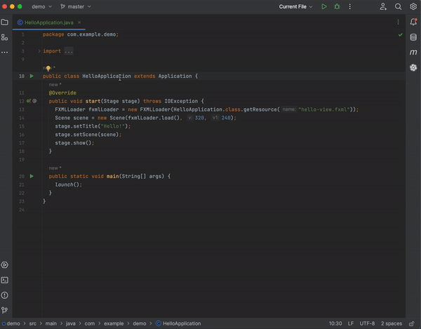

 

  
  <h1 style="margin: 0;" align="center">CodeGPT</h1>
  

    A JetBrains extension that allows you to use ChatGPT inside your favourite IDE
  

[![Downloads][downloads-shield]][plugin-repo]
[![Rating][Rating-shield]][plugin-repo]
[![Version][version-shield]][plugin-repo]
[![Contributions not available][contributions-not-available-svg]][contributions-not-available]

<!-- TABLE OF CONTENTS -->

  
Table of Contents

  <ol>
    <li><a href="#about-the-project">About The Project</a></li>
    <li>
      <a href="#getting-started">Getting Started</a>
      <ul>
        <li><a href="#prerequisites">Prerequisites</a></li>
        <li><a href="#installation">Installation</a></li>
        <li><a href="#api-key-configuration">API Key Configuration</a></li>
      </ul>
    </li>
    <li><a href="#features">Features</a></li>
    <li><a href="#roadmap">Roadmap</a></li>
    <li><a href="#license">License</a></li>
  </ol>

## About The Project

This is an extension for JetBrains IDEs that integrates ChatGPT into your coding environment.
By leveraging the power of GPT-3, this makes it an invaluable tool for developers looking to streamline their workflow and gain a deeper understanding of the code they're working on.

## Getting Started

To get started, follow these simple steps:

### Prerequisites

In order to use the extension, you need to have a JetBrains IDE installed and the API key configured.
You can find the API key in your [User settings][api-key-url].

### Installation

The plugin is available from [JetBrains Marketplace][plugin-repo].
You can install it directly from your IDE via the `File | Settings/Preferences | Plugins` screen.
On the `Marketplace` tab simply search for `codegpt` and select the `CodeGPT` suggestion:

![marketplace][marketplace-img]

### API Key Configuration

After the plugin has been successfully installed, the API key needs to be configured.

You can configure the key by going to the plugin's settings via the `File | Settings/Preferences | Tools | CodeGPT`.
On the settings panel simply click on the `API key` field, paste the key obtained from the OpenAI website and click `Apply/OK`:

![plugin-settings][plugin-settings]

#### Azure OpenAI configuration
Specifically for Azure OpenAI services, you will have to input three supplementary fields:
* the `Resource Name`, which is the name of your Azure OpenAI Cognitive Services. It's the first part of the url you're provided to use the service: `https://my-resource-name.openai.azure.com/` -> use `my-resource-name`. You can find it in your Azure Cognitive Services page, under `Resource Management` -> `Resource Management` -> `Keys and Endpoints`.
* the `Deployment ID`, which is the name of your Deployment. You can find it in the Azure AI Studio, under `Management` -> `Deployment` -> `Deployment Name` column in the table.
* the `API Version`, I usually used the last non-preview version, which is currently `2023-05-15`. 
In addition to these, you need to input one of the two API Keys provided, found along with the `Resource Name`.

## Features

The plugin provides several key features, such as:

### Ask Anything

Ask anything you'd like.

  

### Select and Ask

Ask anything related to your selected code.

  

### Replace Generated Code

Instantly replace a selected code block in the editor with suggested code generated by AI.

  

### Regenerate Response

Expected a different answer? Re-generate any response of your choosing.

  

### Other features

- **Conversation History** - View recent conversation history and restore previous sessions, making it easy to pick up where you left off
- **Concurrent conversations** - Chat with the AI in multiple tabs simultaneously
- **Seamless conversations** - Chat with the AI regardless of the maximum token limitations
- **Predefined Actions** - Create your own editor actions or override the existing ones, saving time rewriting the same prompt repeatedly

## Roadmap

- [x] Add proxy support
- [ ] Add conversation history
    - [x] Ability to start/restore sessions
    - [ ] Ability to export conversations in Markdown/JSON format
- [ ] Add codex and user's fine-tuned models
- [x] Ability to have a seamless conversation despite to token limitation
- [x] Add support for copying and replacing generated code snippets
- [x] Add support for deleting previous conversations  
- [x] Add support for overriding prompts and request params
- [x] Add Azure OpenAI service support
- [x] Add action key mappings
- [ ] Add support for code search using embeddings 
- [ ] Add support for model fine-tuning

See the [open issues][open-issues] for a full list of proposed features (and known issues).

## License

MIT © [Carl-Robert Linnupuu][portfolio]

If you found this project interesting, kindly rate it on the marketplace and don't forget to give it a star. Thanks again!

(<a href="#readme-top">back to top</a>)

<!-- MARKDOWN LINKS & IMAGES -->
<!-- https://www.markdownguide.org/basic-syntax/#reference-style-links -->

[downloads-shield]: https://img.shields.io/jetbrains/plugin/d/21056-codegpt
[version-shield]: https://img.shields.io/jetbrains/plugin/v/21056-codegpt?label=version
[rating-shield]: https://img.shields.io/jetbrains/plugin/r/rating/21056-codegpt
[contributions-not-available-svg]: https://img.shields.io/badge/Contributions-Currently%20Unavailable-yellow
[contributions-not-available]: #
[marketplace-img]: docs/assets/marketplace.png
[plugin-repo]: https://plugins.jetbrains.com/plugin/21056-codegpt
[plugin-settings]: docs/assets/plugin-settings.png
[open-issues]: https://github.com/carlrobertoh/CodeGPT/issues
[api-key-url]: https://platform.openai.com/account/api-keys
[portfolio]: https://carlrobert.ee
