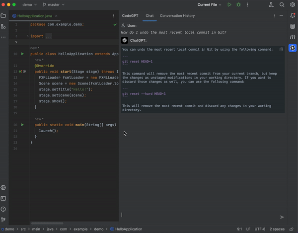
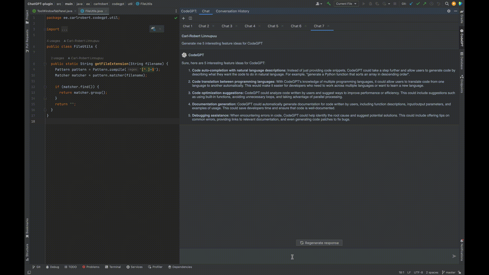

 

  
  <h1 style="margin: 0;" align="center">CodeGPT</h1>
  

    A JetBrains extension that allows you to use ChatGPT inside your favourite IDE
  

[![Contributions welcome][contributions-welcome-svg]][contributions-welcome]
[![Downloads][downloads-shield]][plugin-repo]
[![Rating][Rating-shield]][plugin-repo]
[![Version][version-shield]][plugin-repo]

<!-- TABLE OF CONTENTS -->

  
Table of Contents

  <ol>
    <li><a href="#about-the-project">About The Project</a></li>
    <li>
      <a href="#getting-started">Getting Started</a>
      <ul>
        <li><a href="#prerequisites">Prerequisites</a></li>
        <li><a href="#installation">Installation</a></li>
        <li><a href="#api-key-configuration">API Key Configuration</a></li>
      </ul>
    </li>
    <li><a href="#features">Features</a></li>
    <li><a href="#roadmap">Roadmap</a></li>
    <li><a href="#contributing">Contributing</a></li>
    <li><a href="#license">License</a></li>
  </ol>

## About The Project

This is an extension for JetBrains IDEs that integrates ChatGPT into your coding environment.
By leveraging the power of GPT-3, this makes it an invaluable tool for developers looking to streamline their workflow and gain a deeper understanding of the code they're working on.

## Getting Started

To get started, follow these simple steps:

### Prerequisites

In order to use the extension, you need to have a JetBrains IDE installed and the API key configured.
You can find the API key in your [User settings][api-key-url].

### Installation

The plugin is available from [JetBrains Marketplace][plugin-repo].
You can install it directly from your IDE via the `File | Settings/Preferences | Plugins` screen.
On the `Marketplace` tab simply search for `codegpt` and select the `CodeGPT` suggestion:

![marketplace][marketplace-img]

### API Key Configuration

After the plugin has been successfully installed, the API key needs to be configured.

You can configure the key by going to the plugin's settings via the `File | Settings/Preferences | Tools | CodeGPT`.
On the settings panel simply click on the `API key` field, paste the key obtained from the OpenAI website and click `Apply/OK`:

![plugin-settings][plugin-settings]

## Features

The plugin provides several key features, such as:

### Ask ChatGPT

Ask anything you'd like.

  

### Conversation History

View conversation history and restore previous sessions, making it easy to pick up where you left off.

  

### Custom Prompt

Create a custom prompt for your selected code. The previous prompt will be remembered for subsequent questions.

  

### Stop/Regenerate Response

Stop the response generation or re-generate a new response from the existing query.

  

## Roadmap

- [x] Add proxy support
- [ ] Add conversation history
    - [x] Ability to start/restore sessions
    - [ ] Ability to export conversations in Markdown/JSON format
- [ ] Add codex and user's fine-tuned models
- [ ] Ability to have a seamless conversation despite to token limitation
- [ ] Add support for copying and replacing generated code snippets
- [ ] Add support for editing/deleting previous conversations  
- [ ] Add support for overriding prompts and request params
- [ ] Add support for model fine-tuning

See the [open issues][open-issues] for a full list of proposed features (and known issues).

## Contributing

Contributions are what make the open source community such an amazing place to learn, inspire, and create. Any contributions you make are **greatly appreciated**.

If you have a suggestion that would make this better, please fork the repo and create a pull request. You can also simply open an issue with the tag "enhancement".

1. Fork the Project
2. Create your Feature Branch (`git checkout -b feature/AmazingFeature`)
3. Commit your Changes (`git commit -m 'Add some AmazingFeature'`)
4. Push to the Branch (`git push origin feature/AmazingFeature`)
5. Open a Pull Request

## License

MIT © [Carl-Robert Linnupuu][portfolio]

If you found this project interesting, kindly rate it on the marketplace and don't forget to give it a star. Thanks again!

(<a href="#readme-top">back to top</a>)

<!-- MARKDOWN LINKS & IMAGES -->
<!-- https://www.markdownguide.org/basic-syntax/#reference-style-links -->

[downloads-shield]: https://img.shields.io/jetbrains/plugin/d/21056-codegpt
[version-shield]: https://img.shields.io/jetbrains/plugin/v/21056-codegpt?label=version
[rating-shield]: https://img.shields.io/jetbrains/plugin/r/rating/21056-codegpt
[contributions-welcome-svg]: http://img.shields.io/badge/contributions-welcome-brightgreen
[contributions-welcome]: https://github.com/JetBrains/ideavim/blob/master/CONTRIBUTING.md
[marketplace-img]: docs/assets/marketplace.png
[plugin-repo]: https://plugins.jetbrains.com/plugin/21056-codegpt
[plugin-settings]: docs/assets/plugin-settings.png
[open-issues]: https://github.com/carlrobertoh/CodeGPT/issues
[api-key-url]: https://platform.openai.com/account/api-keys
[portfolio]: https://carlrobert.ee
