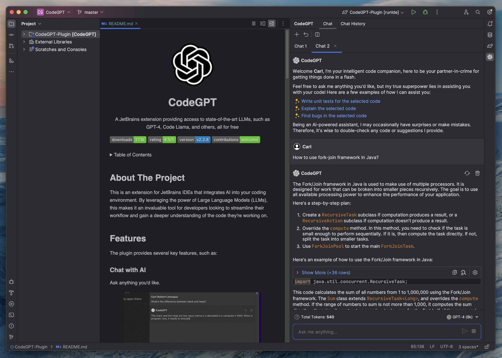
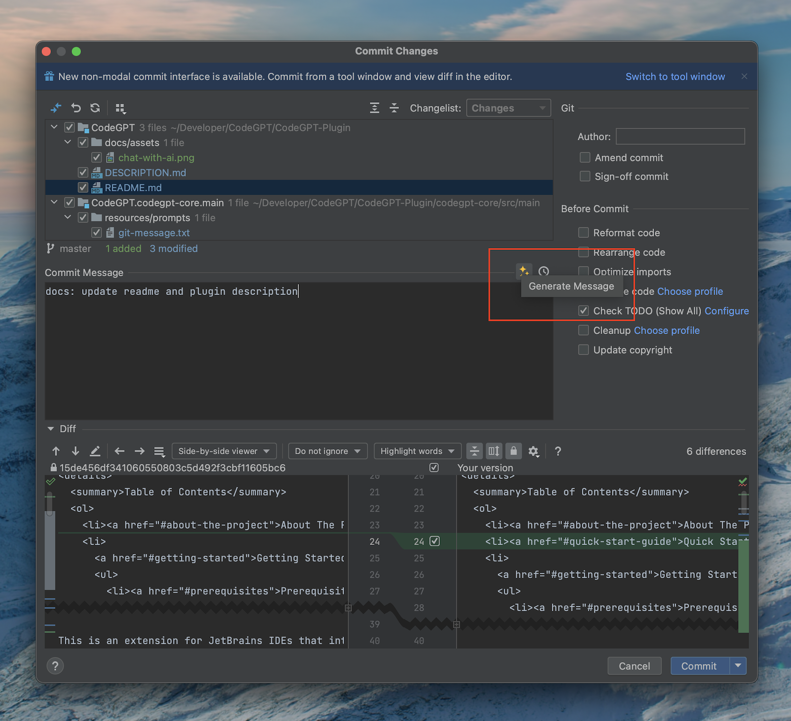
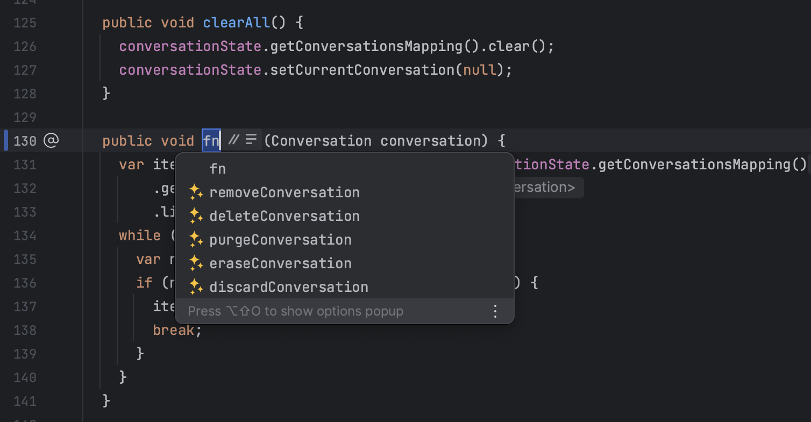
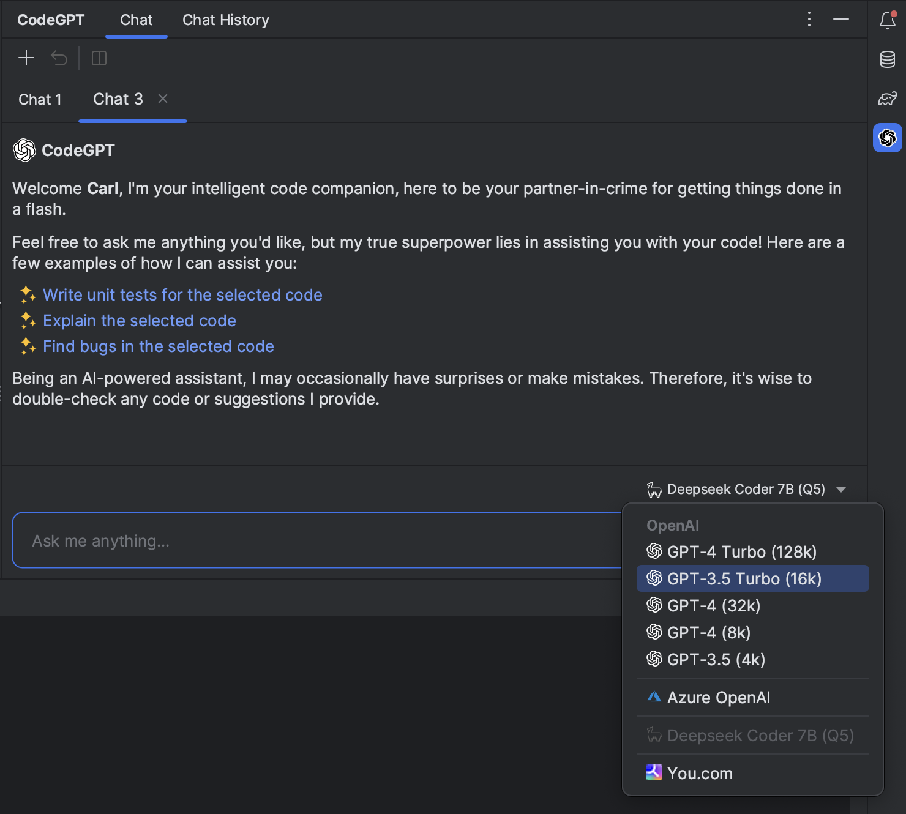

<a name="readme-top"></a>

<br />
<div align="center">
  <a href="https://github.com/carlrobertoh/CodeGPT">
    
  </a>
  <h1 style="margin: 0;" align="center">CodeGPT</h1>
  <p>
    A JetBrains extension providing access to state-of-the-art LLMs, such as GPT-4, Code Llama, and others, all for free
  </p>
</div>

[![Downloads][downloads-shield]][plugin-repo]
[![Rating][Rating-shield]][plugin-repo]
[![Version][version-shield]][plugin-repo]
[![Contributions welcome][contributions-welcome-svg]][contributions-welcome]

<!-- TABLE OF CONTENTS -->
<details>
  <summary>Table of Contents</summary>
  <ol>
    <li><a href="#about-the-project">About The Project</a></li>
    <li><a href="#quick-start-guide">Quick Start Guide</a></li>
    <li>
      <a href="#getting-started">Getting Started</a>
      <ul>
        <li><a href="#prerequisites">Prerequisites</a></li>
        <li><a href="#installation">Installation</a></li>
        <li><a href="#api-key-configuration">API Key Configuration</a></li>
      </ul>
    </li>
    <li><a href="#features">Features</a></li>
    <li><a href="#roadmap">Roadmap</a></li>
    <li><a href="#license">License</a></li>
  </ol>
</details>

## About The Project

This is an extension for JetBrains IDEs that integrates AI into your coding environment.
By leveraging the power of Large Language Models (LLMs), this makes it an invaluable tool for developers looking to streamline their workflow and gain a deeper understanding of the code they're working on.

## Features

The plugin provides several key features, such as:

### Chat with AI

<p align="center">
  
</p>

### Generate Git Commit Messages

<p align="center">
  
</p>

### Method name suggestions

<p align="center">
  
</p>

### Multiple providers

<p align="center">
  
</p>

### Other features

- **Conversation History** - View recent conversation history and restore previous sessions, making it easy to pick up where you left off
- **Concurrent conversations** - Chat with AI in multiple tabs simultaneously
- **Seamless conversations** - Chat with AI regardless of the maximum token limitations
- **Predefined Actions** - Create your own editor actions or override the existing ones, saving time rewriting the same prompt repeatedly

## Getting Started

1. **Download the Plugin**

2. **Choose Your Preferred Service**:

   a) **OpenAI** - Requires authentication via OpenAI API key.

   b) **Azure** - Requires authentication via Active Directory or API key.

   c) **You.com** - A free, web-connected service with an optional upgrade to You⚡Pro for enhanced features.

   d) **LLaMA C/C++ Port** - Recommended to have a decent computer to handle the computational requirements of running inference.
   > **Note**: Currently supported only on Linux and MacOS.

3. **Start Using the Features**

### Installation

The plugin is available from [JetBrains Marketplace][plugin-repo].
You can install it directly from your IDE via the `File | Settings/Preferences | Plugins` screen.
On the `Marketplace` tab simply search for `codegpt` and select the `CodeGPT` suggestion:

![marketplace][marketplace-img]

### OpenAI

After successful installation, configure your API key. Navigate to the plugin's settings via **File | Settings/Preferences | Tools | CodeGPT**. Paste your OpenAI API key into the field and click `Apply/OK`.

### Azure OpenAI

For Azure OpenAI services, you'll need to input three additional fields:

- **Resource name**: The name of your Azure OpenAI Cognitive Services. It's the first part of the url you're provided to use the service: "https://**my-resource-name**.openai.azure.com/". You can find it in your Azure Cognitive Services page, under `Resource Management` → `Resource Management` → `Keys and Endpoints`.
- **Deployment ID**: The name of your Deployment. You can find it in the Azure AI Studio, under `Management` → `Deployment` → `Deployment Name` column in the table.
- **API version**: The most recent non-preview version.

In addition to these, you need to input one of the two API Keys provided, found along with the `Resource Name`.

### You.com (Free)

**You.com** is a search engine that summarizes the best parts of the internet for **you**, with private ads and with privacy options.

**You⚡Pro**

Use the **CodeGPT** coupon for a free month of unlimited GPT-4 usage.

Check out the full [feature list](https://about.you.com/hc/youpro/what-features-are-included-in-youpro/) for more details.

### LLaMA C/C++ Port (Free, Local)

> **Note**: Currently supported only on Linux and MacOS.

The main goal of `llama.cpp` is to run the LLaMA model using 4-bit integer quantization on a MacBook.

#### Getting Started

1. **Select the Model**: Depending on your hardware capabilities, choose the appropriate model from the provided list. Once selected, click on the `Download Model` link. A progress bar will appear, indicating the download process.

2. **Start the Server**: After successfully downloading the model, initiate the server by clicking on the `Start Server` button. A status message will be displayed, indicating that the server is starting up.

3. **Apply Settings**: With the server running, you can now apply the settings to start using the features. Click on the `Apply/OK` button to save your settings and start using the application.


> **Note**: If you're already running a server and wish to configure the plugin against that, then simply select the port and click `Apply/OK`.

### Running locally

**Linux or macOS**
```shell
git clone https://github.com/carlrobertoh/CodeGPT.git
cd CodeGPT
git submodule update
./gradlew runIde
```

**Windows ARM64**
```shell
./gradlew runIde -Penv=win-arm64
```

## Issues

See the [open issues][open-issues] for a full list of proposed features (and known issues).

## License

MIT © [Carl-Robert Linnupuu][portfolio]

If you found this project interesting, kindly rate it on the marketplace and don't forget to give it a star. Thanks again!
<p align="right">(<a href="#readme-top">back to top</a>)</p>


<!-- MARKDOWN LINKS & IMAGES -->
<!-- https://www.markdownguide.org/basic-syntax/#reference-style-links -->

[downloads-shield]: https://img.shields.io/jetbrains/plugin/d/21056-codegpt
[version-shield]: https://img.shields.io/jetbrains/plugin/v/21056-codegpt?label=version
[rating-shield]: https://img.shields.io/jetbrains/plugin/r/rating/21056-codegpt
[contributions-welcome-svg]: http://img.shields.io/badge/contributions-welcome-brightgreen
[contributions-welcome]: #
[marketplace-img]: docs/assets/marketplace.png
[plugin-repo]: https://plugins.jetbrains.com/plugin/21056-codegpt
[plugin-settings]: docs/assets/plugin-settings.png
[open-issues]: https://github.com/carlrobertoh/CodeGPT/issues
[api-key-url]: https://platform.openai.com/account/api-keys
[portfolio]: https://carlrobert.ee
